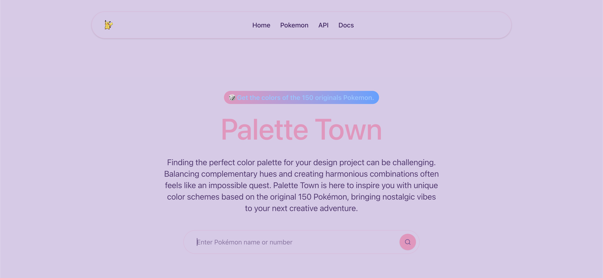

# Palette Town

A Next.js application that generates color palettes based on Pokémon types, providing an easy way for developers and designers to use Pokémon-themed colors in their projects.



## About

Palette Town extracts color schemes from the original 151 Pokémon, offering them in various formats (HEX, RGB, RGBA) through both a user-friendly interface and a public API. Built with Next.js and TypeScript, this project showcases modern web development practices and the power of the PokeAPI.

## Features

- ✨ **Color Extraction**: Generates color palettes based on Pokémon types
- 🎨 **CSS Export**: One-click copy of ready-to-use CSS variables and classes
- 📱 **Responsive Design**: Optimized for all devices from mobile to desktop
- 🔄 **Multiple Color Formats**: HEX, RGB, and RGBA color formats
- 🚀 **API Access**: Public API endpoints for programmatic color palette access
- 🎮 **Gen 1 Coverage**: All 151 original Pokémon supported

## API Usage

### Endpoints

- `GET /api/pokemon/:id` - Get a Pokémon with its color palette
- `GET /api/colors/:id` - Get detailed color formats for a Pokémon
- `GET /api/colors` - Get all Pokémon type colors

### Example Request

```javascript
// Get Pikachu's colors
fetch('https://palette-town.example.com/api/pokemon/25')
  .then(response => response.json())
  .then(data => {
    // Use the color data
    document.body.style.backgroundColor = data.colors.primary;
    document.body.style.color = data.colors.text;
  });
````
